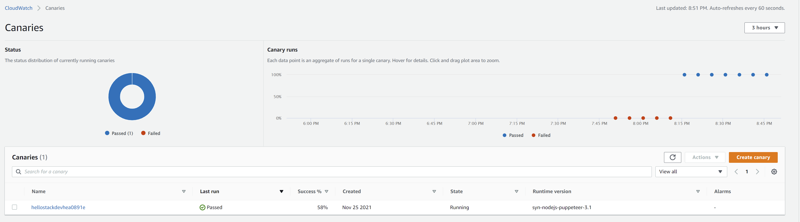

# Sample Web App Deployment with AWS CDK

This project containd CDK/CDK8s code to provision a VPC, an EKS cluster and deploy a sample container image. It also creates pipeline to deploy changes continuously. CloudWatch Synthetics Canaries is employed to perform uptime monitoring.

## Architecture


## Pre-requisities
- [x] **AWS CDK** - check [Getting Started with AWS CDK](https://docs.aws.amazon.com/cdk/latest/guide/getting_started.html) to setup your CDK environment. Run `cdk --version` to check the CLI version.
- [x] **CDK8s** - https://github.com/cdk8s-team/cdk8s
- [x] Nodejs as required by AWS CDK.
- [x] Typescript


## Usage

In order to run make CDK deployment successful(required by the pipeline creation), you need to fork this repo, create a Github PAT and put it in AWS Secret Manager.  See https://docs.aws.amazon.com/cdk/api/latest/docs/aws-codepipeline-actions-readme.html#github.

-   A  [GitHub Access Token](https://help.github.com/en/github/authenticating-to-github/creating-a-personal-access-token-for-the-command-line), with scopes  **repo**  and  **admin:repo_hook**.
-   A  [Secrets Manager Secret](https://docs.aws.amazon.com/secretsmanager/latest/userguide/manage_create-basic-secret.html)  with the value of the  **GitHub Access Token**. The name has to be`github-token`. This token can be stored either as Plaintext or as a Secret key/value. If you stored the token as Plaintext, set  `SecretValue.secretsManager('github-token')`  as the value of  `oauthToken`. If you stored it as a Secret key/value, you must set  `SecretValue.secretsManager('my-github-token', { jsonField : 'github-token' })`  as the value of  `oauthToken`.

Then update `input:  pipelines.CodePipelineSource.gitHub('yuft/hello-aws', 'main'),`in  `main.ts`to reflect your Github repo.

```bash
$ git clone https://github.com/yuft/hello-aws.git
$ cd hello-aws
# install required packages
$ npm ci
# if you have not used cdk in this account previously you may be advised to create the necessary resources in the account
$ cdk bootstrap aws://ACCOUNTNUMBER/ap-southeast-2
# check the diff before deployment
$ cdk diff
# deploy the complete stack
$ cdk deploy
```

## Roadmap

 - Created Production-ready EKS cluster.
 - Build container images push to private ECR, set up IAM roles/policies.
 - ....

## Image Gallery





## Credits
- https://github.com/aws-samples/amazon-eks-cicd-codebuild